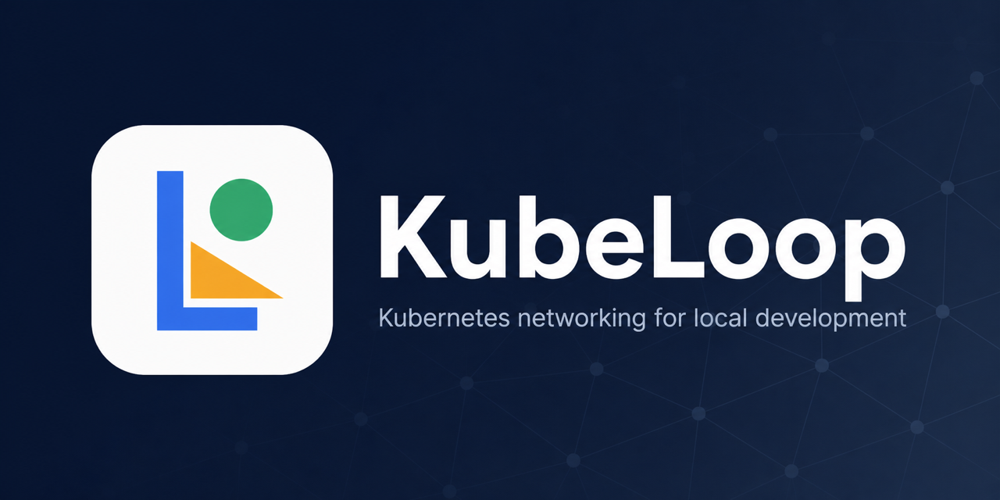

# KubeLoop

[](https://github.com/fengqi-dev/kube-loop/actions/workflows/ci.yml)
[](https://github.com/fengqi-dev/kube-loop/actions/workflows/release.yml)
[](https://github.com/fengqi-dev/kube-loop/releases/latest)
[](LICENSE)

[English](README.md) | [简体中文](README_zh-CN.md)

**[Website](https://fengqi-dev.github.io/kube-loop/)** ·
**[Download](https://github.com/fengqi-dev/kube-loop/releases/latest)** ·
**[Documentation](#documentation)**

KubeLoop is a desktop network tool for Kubernetes development. It connects your
workstation to a cluster like a focused VPN, so browsers, IDEs, CLIs, and SDKs
can directly use Pod IPs, ClusterIP Services, and `*.cluster.local` names.



## Highlights

- **Transparent access** — use cluster addresses from ordinary local applications.
- **Split routing** — only Kubernetes traffic enters the tunnel.
- **No public gateway** — traffic travels through Kubernetes API Server
  port-forward; no NodePort, LoadBalancer, or Ingress is required.
- **One desktop workflow** — connect, inspect, forward, exchange, mirror, preview,
  transfer files, and diagnose from one UI.
- **Cross-platform** — macOS, Windows, and Linux on amd64 and arm64.
- **No `kubectl` dependency** — KubeLoop talks to Kubernetes directly through
  client-go and your kubeconfig.

## Quick start

### 1. Install

**macOS or Linux**

```bash
curl -fsSL https://raw.githubusercontent.com/fengqi-dev/kube-loop/main/scripts/install.sh | bash
```

The installer selects the latest release and the current CPU architecture.
On macOS it downloads a DMG; on Linux it installs a deb/rpm when available or
extracts a tarball.

To choose a release or Linux package format:

```bash
VERSION=v1.5.0 PACKAGE=deb \
  bash -c "$(curl -fsSL https://raw.githubusercontent.com/fengqi-dev/kube-loop/main/scripts/install.sh)"
```

Supported `PACKAGE` values are `deb`, `rpm`, and `tarball`.

**Homebrew**

```bash
brew tap kube-loop/kubeloop https://github.com/fengqi-dev/kube-loop
brew install --cask kubeloop
```

**Windows**

```powershell
irm https://raw.githubusercontent.com/fengqi-dev/kube-loop/main/scripts/install.ps1 | iex
```

DMG, NSIS installer, portable zip, deb, rpm, and tar.gz packages are also
available from [GitHub Releases](https://github.com/fengqi-dev/kube-loop/releases/latest).
Every release includes `SHA256SUMS`.

### 2. Connect

1. Make sure your workstation can reach the Kubernetes API Server and has a
   valid kubeconfig.
2. Open KubeLoop and choose a kubeconfig Context and default Namespace.
3. Click **Connect**.
4. Approve the local virtual-network Helper installation on first use.
5. KubeLoop installs or upgrades its unprivileged Gateway in
   `kubeloop-system` when your Kubernetes permissions allow it.

Once connected, open a ClusterIP, Pod IP, or cluster DNS name from any local
application.

## What you can do

| Goal | Workflow |
| --- | --- |
| Access an internal Service | Connect, then use its ClusterIP or DNS name |
| Debug a Pod directly | Connect, then use its Pod IP |
| SSH or SFTP to a Pod without `sshd` | Enable **SSH** for the Pod in **Workload** |
| Expose a Pod or Service port locally | **Port Forward** |
| Route an existing Service to a local app | **Exchange** |
| Copy Service requests to a local observer | **Service Mirror** |
| Expose a local app through a temporary ClusterIP | **Preview** |
| Move files between the workstation and a Pod | **File Manager** |

### Traffic workflows

- **Exchange** preserves an existing Service's ClusterIP and DNS name while
  replacing its backends with a local process.
- **Service Mirror** keeps the original Pods on the primary path and sends a
  copy of each request to a local shadow process. Shadow responses are discarded.
- **Preview** creates a temporary ClusterIP Service backed by a local process.

KubeLoop restores or removes affected Services, Endpoints, and EndpointSlices
when a workflow stops or the cluster connection closes.

### Pod SSH

Pod SSH works in TUN mode without installing or running `sshd` in the container.
KubeLoop authenticates the local SSH client with the user's standard SSH identity
and maps the SSH channel to Kubernetes `pods/exec`.

- The SSH login name selects the Kubernetes container; it does not change the
  process user inside the container.
- Interactive shells and remote commands require `/bin/sh`.
- `scp` and `sftp` use the built-in SFTP adapter. File transfer requires `tar`
  in the container.
- If no `id_ed25519`, `id_ecdsa`, or `id_rsa` identity exists, KubeLoop creates
  `~/.ssh/id_ed25519` without overwriting an existing identity.
- Disconnecting removes the runtime-only SSH endpoints without modifying Pods.

## How it works

```text
Local applications
  → platform TUN + split DNS
  → managed sing-box
  → local SOCKS Bridge
  → Kubernetes API Server port-forward
  → unprivileged in-cluster Gateway
  → Pods / Services / CoreDNS
```

Only discovered or manually configured cluster routes enter the tunnel. The
Gateway makes the final in-cluster connection and has no ServiceAccount token,
`hostNetwork`, `privileged`, or `NET_ADMIN`.

The local Helper is installed once and manages only KubeLoop's sing-box process,
TUN interface, routes, split DNS, and recovery state. It can be inspected or
removed from Settings.

For the complete control plane, data plane, and recovery design, see
[System design](docs/design.md) and
[Unified traffic data plane](docs/singbox-traffic-dataplane.md).

## Kubernetes permissions

KubeLoop uses the identity from the selected kubeconfig Context. The Gateway
does not contain Kubernetes credentials or call the Kubernetes API.

The desktop identity needs access to Pods and Services in each Namespace it
will use, including `kubeloop-system`. Cluster-level reads are used only for
automatic network discovery; when they are unavailable, you can enter the
network values manually. Ask an administrator to precreate `kubeloop-system`
if your identity cannot create Namespaces.

<details>
<summary>Example namespace Role</summary>

```yaml
apiVersion: rbac.authorization.k8s.io/v1
kind: Role
metadata:
  name: kubeloop
  namespace: <namespace>
rules:
  - apiGroups: [""]
    resources: ["pods"]
    verbs: ["get", "list", "watch"]
  - apiGroups: [""]
    resources: ["pods/exec", "pods/portforward"]
    verbs: ["create"]
  - apiGroups: [""]
    resources: ["services"]
    verbs: ["get", "list", "watch", "create", "update", "delete"]
  - apiGroups: [""]
    resources: ["endpoints"]
    verbs: ["get", "create", "update"]
  - apiGroups: ["discovery.k8s.io"]
    resources: ["endpointslices"]
    verbs: ["get", "list", "create", "update", "delete"]
  - apiGroups: ["apps"]
    resources: ["deployments"]
    verbs: ["get", "list", "watch", "create", "update"]
```

Bind this Role to the kubeconfig user in every Namespace KubeLoop may access.

</details>

## MCP for editors and agents

KubeLoop can expose its backend as a local
[Model Context Protocol](https://modelcontextprotocol.io/) server over
Streamable HTTP.

1. Open the **MCP** page.
2. Select Codex, Claude Code, Cursor, or VS Code.
3. Click **Install MCP server**, or copy the generated configuration.

MCP is disabled by default, binds only to `127.0.0.1`, and supports optional
Bearer authentication. It uses the active kubeconfig identity and requires no
additional Kubernetes permissions.

| Tool | Operations |
| --- | --- |
| `manage_cluster` | Reload/probe Contexts; list Namespaces, Services, and Pods |
| `manage_connection` | Read status/config, connect, and disconnect |
| `manage_network` | Read or update network overrides and Host Aliases |
| `manage_traffic` | Start, stop, and list traffic workflows |
| `manage_helper` | Inspect, install, or uninstall the Helper |
| `exec_pod_command` | Execute a command in a Pod container |
| `manage_file_transfer` | Start, list, or cancel local ↔ Pod transfers |

See the [MCP guide](https://fengqi-dev.github.io/kube-loop/mcp.html) for setup
and request examples.

## Security

- kubeconfig credentials stay in the Go desktop process.
- The Gateway is unprivileged, has no Kubernetes credentials, and has no public
  network endpoint.
- Every connection uses a random 256-bit Gateway capability.
- The privileged Helper accepts authenticated, field-constrained IPC rather
  than arbitrary commands or executable paths.
- sing-box and feature inbounds listen locally and use per-session credentials.
- Cluster routes are limited to validated Pod and Service destinations.
- Resource mutations are transactional and recoverable.
- Logs redact credentials, certificates, tokens, and kubeconfig content.

See [Security and permissions](docs/design.md#11-security-and-permissions) for
the trust boundaries and capability model.

## Platform support

| Area | Support |
| --- | --- |
| Desktop | macOS, Windows, Linux |
| CPU | amd64, arm64 |
| UI | System-aware light/dark theme; English and 简体中文 |
| Packages | DMG, NSIS, zip, deb, rpm, tar.gz, Homebrew Cask |
| Application state | `~/.kubeloop` |
| Network core | Pinned sing-box bundled with every release |
| Updates | GitHub Release check from Settings |

## Development

Requirements: Go 1.26+, Node.js 22+, and Wails 2.13.

```bash
git clone --recurse-submodules https://github.com/fengqi-dev/kube-loop.git
cd kube-loop
go install github.com/wailsapp/wails/v2/cmd/wails@v2.13.0
npm ci --prefix frontend
wails dev
```

`wails dev` builds the frontend and platform Helper, then prepares a local
Gateway image for Docker Desktop Kubernetes, Minikube, kind, or k3d. Set
`KUBELOOP_GATEWAY_IMAGE` only when you need to override that image.

### Tests

```bash
npm run build --prefix frontend
go test ./...
```

Run the Minikube end-to-end suite with:

```bash
./e2e/run.sh
```

Platform-local suites:

```bash
./e2e/scripts/run-local-macos.sh --timeout 25m
./e2e/scripts/run-local-linux.sh --timeout 25m
```

```powershell
.\e2e\scripts\run-local-windows.ps1 -Timeout 25m
```

<details>
<summary>Debug the bundled sing-box source</summary>

Initialize the submodule if the repository was cloned without it:

```bash
git submodule update --init --recursive
```

In VS Code, start `Wails: Debug KubeLoop`, connect to a cluster, then start
`third_party: Debug Sing-box`. Delve attaches to the root-owned sing-box
process. TCP and UDP SOCKS outbound breakpoints are in
`third_party/sing-box/protocol/socks/outbound.go`.

For command-line development:

```bash
KUBELOOP_SINGBOX_SOURCE=debug wails dev
sudo "$(go env GOPATH)/bin/dlv" attach "$(pgrep -n -x sing-box)"
```

</details>

### Build

```bash
VERSION=v1.5.0
VITE_APP_VERSION="$VERSION" wails build -ldflags "-X main.version=${VERSION}"
```

Pushing a `v*` tag triggers the release workflow for desktop packages, Gateway
binaries and image, checksums, the Homebrew Cask, and the project website.

## Documentation

- [Product guide](https://fengqi-dev.github.io/kube-loop/product.html)
- [Workflows](https://fengqi-dev.github.io/kube-loop/workflows.html)
- [System design](docs/design.md)
- [Unified traffic data plane](docs/singbox-traffic-dataplane.md)
- [Third-party notices](THIRD_PARTY_NOTICES.md)

## License

KubeLoop is available under the [MIT License](LICENSE). Bundled third-party
components retain their own licenses; see
[THIRD_PARTY_NOTICES.md](THIRD_PARTY_NOTICES.md).
