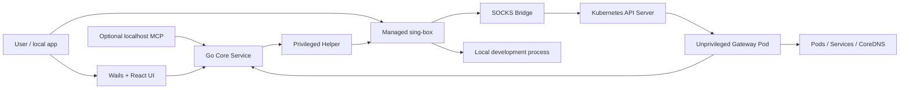
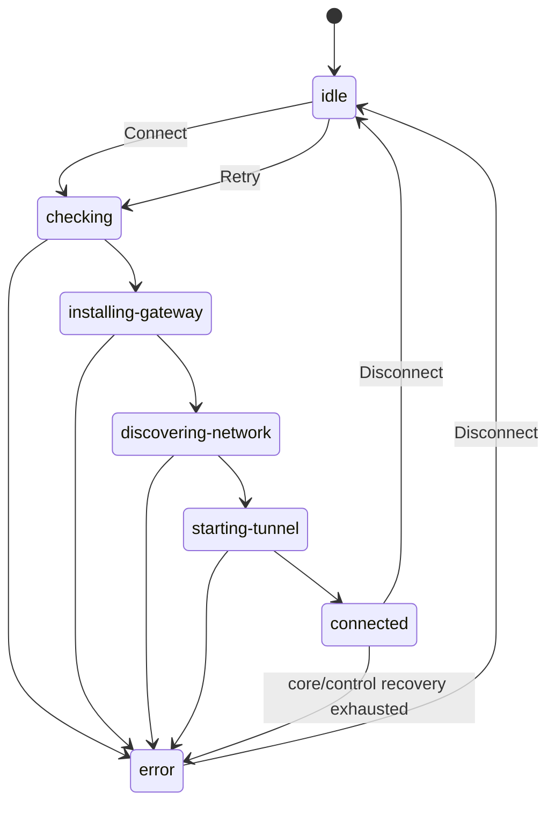

# KubeLoop System Design

[English](design.md) | [简体中文](design.zh-CN.md)

> Status: implemented baseline for KubeLoop v1.5.0
> Audience: contributors, reviewers, operators, and integrators

## 1. Purpose

KubeLoop is a cross-platform desktop network client for Kubernetes development.
It connects a workstation to one cluster at a time so ordinary local applications
can use Pod IPs, ClusterIP Services, and cluster DNS without per-application proxy
settings.

The design follows six principles:

1. **Cluster traffic only.** Public and unrelated private traffic stays on the
   workstation's normal network.
2. **No public cluster ingress.** The data plane reaches the in-cluster Gateway
   through Kubernetes API Server port-forward.
3. **Least privilege.** Kubernetes credentials remain in the desktop process;
   system networking is delegated to a narrow privileged helper; the Gateway is
   unprivileged.
4. **Transactional mutations.** Exchange, Service Mirror, and Preview either publish a
   complete runtime or roll back every earlier mutation.
5. **Recoverable ownership.** Every process, listener, route, DNS rule, Gateway
   registration, and Kubernetes resource has one lifecycle owner.
6. **Explainable diagnostics.** The UI distinguishes what was actually tested
   from topology shown only for context.

## 2. Product model

### 2.1 User-facing capabilities

| Capability | Result |
| --- | --- |
| Cluster connection | Transparent Pod, Service, and cluster-DNS access through TUN |
| Port Forward | Expose a Pod or Service port on a local TCP/UDP listener |
| Exchange | Replace an existing Service's backends with a local process |
| Service Mirror | Intercept an existing Service, keep its original Pods as Primary, and tee requests to a local process |
| Preview | Create a temporary ClusterIP Service backed by a local process |
| Session diagnostics | Test active TCP sessions and identify the failed diagnostic layer |
| MCP | Optionally control the same application backend through localhost Streamable HTTP |

The desktop UI, MCP server, and restored persisted intents all call the same Go
managers. They are control surfaces, not independent implementations.

### 2.2 Non-goals

KubeLoop is not:

- a general-purpose VPN or public proxy;
- a Service Mesh identity emulator;
- an ICMP tunnel with full ping semantics;
- a multi-cluster concurrent router;
- a replacement for application-level health checks;
- a way to bypass Kubernetes RBAC.

UDP transport is supported, but a generic UDP connectivity test is not: health
requires a protocol-specific request and response.

## 3. System context



The system has four trust boundaries:

- **UI boundary:** React receives display-safe state and invokes typed Wails
  bindings. It never receives raw kubeconfig credentials.
- **desktop boundary:** the Go process owns Kubernetes clients, session state,
  feature registries, persistence, and the Gateway protocols.
- **privilege boundary:** the helper accepts authenticated, field-constrained
  session descriptions; it does not accept commands or caller-selected paths.
- **cluster boundary:** the Gateway has no ServiceAccount token, `hostNetwork`,
  `privileged`, or `NET_ADMIN`, and is not published through Service or Ingress.

## 4. Component responsibilities

| Component | Owns |
| --- | --- |
| React UI | Interaction, localization, rendering, and client-side async state |
| Application bindings | Narrow Wails and MCP adapters over the same backend contracts |
| `session.Manager` | One cluster lifecycle, published state, discovery, metrics, restore |
| `client/portforward.Manager` | Local listeners and active Port Forward runtimes |
| `intercept.Manager` | Exchange/Service Mirror/Preview registry, control session, host routes |
| Cluster provider | kubeconfig, RBAC probes, inventory, Gateway and Service mutations |
| Privileged helper | sing-box process, TUN, routes, split DNS, protected recovery state |
| sing-box | Fixed inbounds, policy routing, local/cluster outbounds, core metrics |
| SOCKS Bridge | Adapt `kubernetes-out` to the Gateway tunnel protocol |
| Gateway | Cluster-side dial, reverse listeners, TCP/UDP relay |
| Store | Per-context preferences, manual network data, aliases, and restore intents |

High-frequency metrics and inventory updates are published through a state hub so
they do not contend with connection lifecycle bookkeeping.

## 5. Cluster connection lifecycle

### 5.1 State machine

The externally visible phases are:



Only one run may be active. `Connect` installs a cancellation function and a
completion channel before starting work. `Disconnect` cancels that run and waits,
with a bounded timeout, for teardown to finish. Idle is published only after owned
runtime resources have closed.

### 5.2 Startup order

1. Probe the selected context and discover effective RBAC capabilities.
2. Install/upgrade the Gateway, or reuse an administrator-preinstalled Gateway.
3. Discover Pod routes, Service routes, DNS, Kubernetes version, and scoped
   inventory; merge saved manual overrides.
4. Open API Server port-forward to the Gateway.
5. Start the Gateway control channel.
6. Start the local SOCKS Bridge and attach host-route handlers.
7. Ask the helper to generate and start the sing-box session.
8. Validate fixed feature inbounds and bind feature traffic dialers.
9. Publish Connected, probe cluster DNS, restore persisted features, and start
   inventory and metrics loops.

A `sessionRuntime` records each resource as it is created and closes resources in
reverse registration order. Cleanup is idempotent so startup failure, explicit
disconnect, and application shutdown may converge safely.

### 5.3 Connected-loop recovery

The connected loop reacts to cancellation, sing-box exit, Gateway control loss,
and metric ticks. Control recovery first redials the current Gateway channel. Later
attempts may find a replacement Gateway Pod, open a new API port-forward, update
the SOCKS Bridge address, and re-register active listeners.

A monotonically increasing control generation rejects stale recovery results.
After five bounded attempts, the session enters Error instead of silently running
with a partially available data plane.

## 6. Network discovery and transparent data path

### 6.1 Discovery

The cluster provider derives:

- Pod CIDRs from Nodes and observed Pods;
- Service CIDRs when available, otherwise precise Service IP routes;
- cluster DNS server and search domains;
- inventory scoped to cluster-wide or permitted Namespaces;
- capability issues that disable only the affected features.

Users with restricted RBAC can save Pod CIDRs, Service CIDRs, DNS server, DNS
Namespace, cluster domains, and host aliases per context. Manual values are
validated and merged with discovered values.

Before TUN startup, KubeLoop compares cluster routes with local interfaces, VPNs,
Docker/VM networks, and default routes. Conflicts are surfaced explicitly.

### 6.2 Transparent traffic

```text
Local application
  → platform TUN
  → sing-box tun-in
  → kubernetes-out
  → local SOCKS Bridge
  → Kubernetes API Server port-forward
  → Gateway
  → Pod / Service / CoreDNS
```

sing-box receives fixed routes for cluster destinations. Cluster traffic selects
`kubernetes-out`; unrelated traffic remains `direct-out`. The Gateway performs the
final in-cluster dial, so the target sees cluster-originated traffic rather than the
workstation's physical address.

### 6.3 DNS

The helper installs platform-appropriate split DNS for configured cluster domains.
Queries enter `dns-in`, follow the cluster route through the Bridge and Gateway, and
reach CoreDNS. Public DNS continues to use the operating system's normal resolver.

Platform adapters contain all route and DNS mutation logic. Common session code
works only with validated network specifications and cleanup contracts.

## 7. Unified feature data plane

sing-box creates fixed feature inbounds once per cluster session. Creating or
stopping an individual mapping never restarts sing-box.

| Inbound/user | Destination class | Used by |
| --- | --- | --- |
| `traffic-in` / `port-forward` | Cluster through `kubernetes-out` | Port Forward |
| `traffic-in` / `exchange` | Authorized local target through `local-out` | Exchange |
| `traffic-in` / `preview` | Authorized local target through `local-out` | Preview |
| `traffic-in` / `mirror-shadow` | Authorized local target through `local-out` | Service Mirror Shadow |

The shared inbound listens on loopback, uses a session-random password, and uses
the SOCKS username as a feature dye. Unknown users, cluster targets for local-class
features, and invalid target combinations are rejected.

See [Unified Traffic Data Plane Design](singbox-traffic-dataplane.md) for protocol
adaptation, routing rules, backpressure, and UDP association details.

## 8. Feature sessions

### 8.1 Port Forward

Port Forward exposes a selected Pod or Service port on a local listener. While the
cluster session is connected, feature traffic enters sing-box as `port-forward`
and exits through the Gateway path. The manager persists successful starts and
removes the intent only after a successful stop.

### 8.2 Exchange

Exchange rewrites an existing ClusterIP Service:

1. Reserve `namespace/service` and register Gateway reverse-listen ports.
2. Snapshot the selector, classic Endpoints, and EndpointSlices.
3. Clear the selector and install a managed EndpointSlice pointing to the Gateway.
4. Route reverse traffic to the configured local targets.
5. On stop, restore the snapshot and unregister listeners.

Cluster clients keep the original ClusterIP and DNS name.

### 8.3 Preview

Preview creates a new selectorless ClusterIP Service and managed EndpointSlice
pointing to Gateway listeners. Stopping Preview deletes the created resources and
host routes. It does not mutate an existing Service.

### 8.4 Service Mirror

Service Mirror is defined on an existing Kubernetes Service. It uses the same
Service interception point and resource snapshot as Exchange, then splits each
request into two paths:

- **Primary:** Gateway dials an original Pod from the pre-intercept snapshot and
  returns its response to the cluster client.
- **Shadow:** request data is copied to the configured local process; its response
  is discarded.

Shadow failure, slowness, disconnect, or buffer pressure must not interrupt Primary.

### 8.5 Transactional start and stop

Exchange, Service Mirror, and Preview startup:

1. snapshots the control generation and reserves the feature key;
2. validates targets and registers Gateway ports;
3. applies Kubernetes mutations;
4. installs host routes and constructs the runtime;
5. publishes only if the lifecycle snapshot is still current;
6. persists only after commit.

Deferred compensations undo completed stages in reverse order. A failed stop keeps
the runtime and restore intent visible so it can be retried; it is never reported as
stopped merely because part of cleanup succeeded.

## 9. Active session diagnostics

The Network view renders active sessions and offers a TCP connectivity test.

| Session | Probe | Failure layer |
| --- | --- | --- |
| Port Forward | Dial the active local listener | `local-listener` |
| Exchange/Service Mirror/Preview | Check control readiness and registered ports, then dial every TCP local target | `gateway-control`, `local-target` |

The result dialog shows the full topology, but tested and topology-only segments
are visually different. Exchange/Service Mirror/Preview tests do not create a cluster
workload, send an application payload through the Service, or validate business
response semantics. Retest repeats the same session target after completion.

## 10. Persistence and failure semantics

Persisted data includes context selection, manual network settings, host aliases,
UI preferences, the previous connected flag, and feature restore intents.

Required invariants:

- startup cancellation returns to Idle and permits immediate reconnect;
- Kubernetes resources are restored before dependent data-plane resources close;
- active Gateway listeners are re-registered before recovered control becomes ready;
- sing-box startup retries bounded local control/DNS port collisions with new ports;
- no failed path silently bypasses sing-box or changes the selected traffic policy;
- shutdown preserves restore intent for next-launch recovery;
- explicit disconnect clears the connected flag after cleanup.

## 11. Security and permissions

### 11.1 Local security

- kubeconfig credentials remain in the Go desktop process;
- helper IPC authenticates the caller and validates every field;
- helper state and generated configs live in protected system storage;
- feature inbounds and MCP bind only to `127.0.0.1`;
- MCP is off by default; optional Bearer authentication may be enabled;
- logs redact kubeconfig, tokens, certificates, and secrets.

### 11.2 Cluster security

The Gateway is a dialer and reverse-listener relay, not a Kubernetes controller.
All Kubernetes reads and mutations use the user's desktop kubeconfig.

Capability tiers degrade independently:

| Permission | Effect when absent |
| --- | --- |
| Gateway install/update | Require administrator-preinstalled Gateway |
| Gateway Pod port-forward | Connection cannot start |
| Nodes/CoreDNS/cluster-wide inventory | Use scoped discovery and manual network values |
| Service/Endpoints/EndpointSlice writes | Disable Exchange, Service Mirror, and Preview |
| Namespace inventory | Limit selection and watches to permitted Namespaces |

Gateway images are version-pinned for releases. No NodePort, LoadBalancer, Ingress,
host networking, privileged container, or mounted ServiceAccount token is required.

## 12. Observability

Published state includes phase, human-readable message, capabilities, discovery,
network issues, inventory revision, versions, active connections, and timestamps.
Metrics combine sing-box snapshots with feature-aware traffic tracking.

The UI exposes:

- connection duration and current phase;
- upload/download, active TCP/UDP connections, and recent traffic;
- Pod/Service/DNS discovery and conflict diagnostics;
- active feature sessions;
- connectivity-test result, error, and failed layer;
- redacted structured logs and generated sing-box configuration.

Diagnostic output excludes traffic payloads, Kubernetes Secrets, and raw kubeconfig
content by default.

## 13. Cross-platform and release design

The Go control plane, React UI, Gateway protocol, and feature managers are shared.
Only helper installation, process supervision, TUN, routes, DNS, packaging, and
platform tests vary by operating system.

| Platform | Packages |
| --- | --- |
| macOS | DMG and tar.gz for amd64/arm64; Homebrew Cask |
| Windows | NSIS installer and portable zip for amd64/arm64 |
| Linux | deb, rpm, and tar.gz for amd64/arm64 |

Release tags build desktop artifacts, Gateway binaries, a multi-architecture Gateway
image, and `SHA256SUMS`. Packages include a pinned sing-box binary and platform helper.

## 14. Verification criteria

A release is acceptable when:

1. Pod IP, ClusterIP, and cluster DNS traffic work without per-app configuration.
2. Non-cluster traffic keeps its normal route.
3. Connect/disconnect and startup cancellation leave no TUN, route, DNS, process,
   listener, or Kubernetes-resource leak.
4. Exchange restores the original Service resources exactly.
5. Preview deletes everything it created.
6. Service Mirror Primary remains correct when Shadow fails or is slow.
7. TCP and UDP feature data paths satisfy their documented semantics.
8. TCP diagnostics report the correct layer and never claim untested topology passed.
9. Restricted RBAC produces actionable capability errors and safe degradation.
10. Unit, race, cross-platform build, and end-to-end suites pass.

## 15. Related documents

- [Unified Traffic Data Plane Design](singbox-traffic-dataplane.md)
- [Product website architecture](../site/architecture.html)
- [English README](../README.md)
- [Simplified Chinese README](../README_zh-CN.md)
