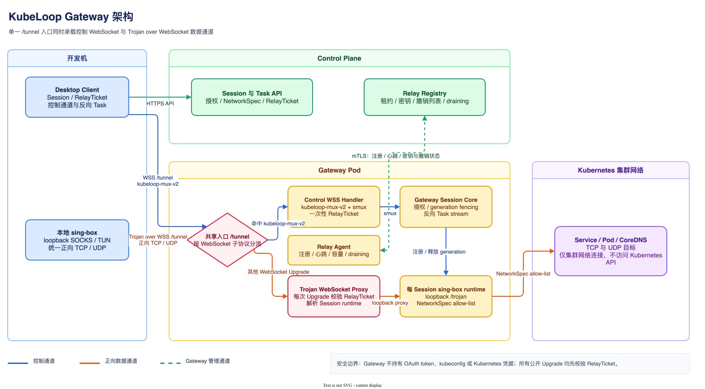
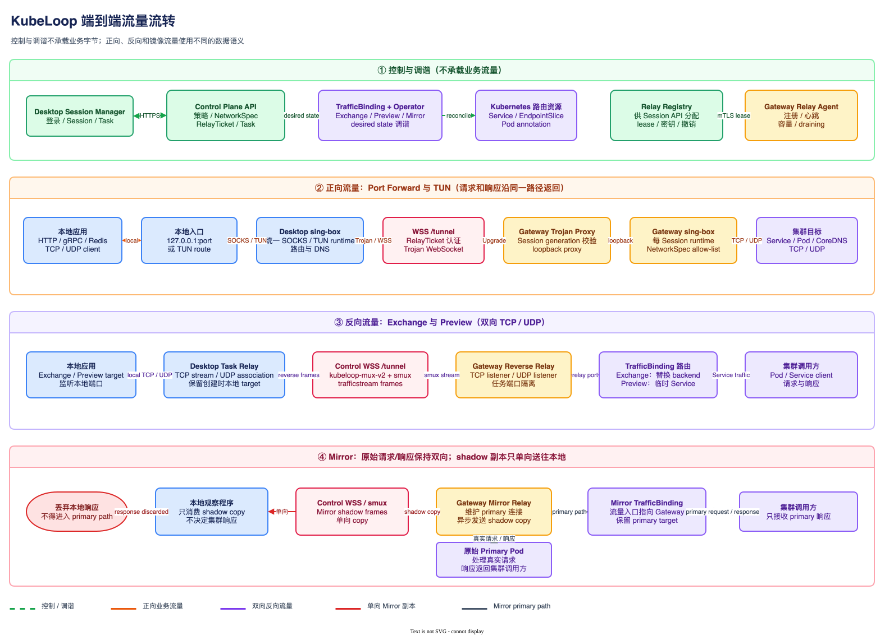

# KubeLoop system design

KubeLoop connects a developer workstation to authorized Kubernetes network and
workload operations without putting kubeconfig or Kubernetes credentials in the
desktop application.

## Components

- **Desktop** stores Server Profiles and OAuth/OIDC credentials in the platform
  credential vault. It runs the UI, local SOCKS endpoint, managed sing-box,
  traffic listeners, Pod SSH adapter, file-transfer manager, and optional MCP
  server.
- **Local Helper** is used only for TUN mode. It owns the TUN interface, routes,
  split DNS, managed sing-box lifecycle, and crash recovery. SOCKS mode does not
  require it.
- **Control Plane** authenticates users, applies policy and Kubernetes SSAR,
  owns Cluster Sessions and Tasks, performs Kubernetes API and SPDY operations,
  and issues short-lived RelayTickets.
- **Gateway** accepts ticket-bound WebSocket transports. Trojan over WebSocket
  carries forward TCP/UDP traffic, while the KubeLoop control WebSocket carries
  Session authorization and reverse Task streams. It holds no OAuth token,
  kubeconfig, or Kubernetes credential.
- **Operator** reconciles durable `TrafficBinding` resources and restores or
  removes Kubernetes resources for Exchange, Mirror, and Preview workflows.

## Gateway architecture



Both public transports enter through `/tunnel`. The shared handler selects the
control WSS path only when the client requests the `kubeloop-mux-v2` WebSocket
subprotocol; every other valid WebSocket Upgrade is handled by the Trojan
proxy. An authenticated control stream registers the Session generation and
its NetworkSpec before forward traffic is admitted. The proxy then resolves
that generation to a loopback, per-Session sing-box runtime, whose final route
is deny-by-default. The Relay Agent independently registers capacity and
refreshes leases, ticket keys, revocations, and draining state with the Control
Plane. Gateway connects to workload addresses through the cluster network and
does not call the Kubernetes API.

## End-to-end traffic flow



Port Forward and TUN share one client-initiated path through the desktop
sing-box, Trojan over WSS, the Gateway proxy, and a NetworkSpec-scoped Gateway
sing-box runtime. Responses return along the same path. Exchange and Preview
instead use bidirectional reverse-task streams: `TrafficBinding` routes cluster
traffic to a Gateway listener, and the control WSS carries it to the retained
local target. Mirror keeps the real request and response on the primary path;
only a shadow copy travels to the local observer, and the observer response is
discarded. Session APIs, Relay Registry traffic, and Operator reconciliation
are control paths and never carry application payload bytes.

## Connection lifecycle

1. The user adds a KubeLoop Server HTTPS URL. The desktop reads the discovery
   document and records a Server Profile.
2. Authentication completes in the system browser using Authorization Code and
   PKCE. Access and refresh credentials are scoped to that Profile.
3. The user selects an authorized Namespace and connection mode.
4. The desktop creates a Cluster Session. The Control Plane returns the exact
   NetworkSpec, assigned Data Plane, and short-lived RelayTicket.
5. The desktop establishes RelayTicket-authenticated Trojan/WSS and control WSS
   transports. SOCKS is exposed on loopback; TUN additionally installs scoped
   routes and split DNS through the Helper.
6. Heartbeats renew Session state and rotate transport material. Disconnect,
   logout, Profile switching, namespace switching, or grant revocation drains
   tasks and closes the old Session.

```text
Local application
  -> TUN or loopback SOCKS
  -> managed sing-box
  -> RelayTicket-authenticated Trojan over WebSocket
  -> assigned Gateway
  -> Pod / Service / CoreDNS
```

Only destinations in the signed NetworkSpec are routed through the data path.
TUN must fail closed for those routes; unrelated workstation traffic is not
silently redirected.

## Control and data separation

The desktop calls only the authenticated Control Plane API. Kubernetes
discovery, policy checks, Pod exec, file operations, task ownership, and
compensation remain server-side. The Data Plane receives only the information
required to carry a particular Session stream. A RelayTicket binds the user,
device, Session, generation, Data Plane, expiry, and allowed transport purpose.

The desktop production graph does not import Kubernetes clients or read
`KUBECONFIG`. The Data Plane does not import Control Plane, OAuth, database, or
Kubernetes client packages. Architecture tests enforce both constraints.

## Traffic workflows

- **Port Forward** creates a Session-owned Task that maps a loopback TCP or UDP
  endpoint to a Pod or Service target.
- **Exchange** temporarily replaces an existing Service backend with a path to a
  local process while preserving Service identity.
- **Mirror** preserves the primary Pod response and sends a copy to a local
  observer; the observer response cannot enter the primary path.
- **Preview** creates a temporary Service whose traffic reaches a local process.

Every mutation carries the exact `profileId`, `sessionId`, and `namespace`.
Creation endpoints use idempotency keys. Durable server-side snapshots and
`TrafficBinding` ownership allow a replacement Control Plane to finish cleanup
after a client or controller failure.

## Workload operations

Pod exec and TTY use authenticated Control Plane Tasks and WebSocket streams;
the Control Plane performs the Kubernetes SPDY operation. Pod SSH is a loopback,
public-key-only adapter over that exec path and does not install `sshd` in Pods.
File transfer and Pod file list/create/rename/delete use the same active Profile,
Session, namespace, Pod, and container boundary.

## MCP boundary

The optional MCP server binds only to loopback and enables a generated bearer
token by default. It exposes six V2 tools: `manage_cluster`,
`manage_connection`, `manage_traffic`, `exec_pod_command`,
`manage_file_transfer`, and `manage_pod_files`. It uses the same typed Control
Plane clients and active identity as the UI; it cannot select another saved
Profile, load kubeconfig, or mutate Helper/network configuration.

## Failure and recovery

- Relay or Data Plane interruption rotates transport material while keeping the
  local SOCKS address stable when recovery succeeds.
- OAuth grant revocation terminates Sessions and Tasks without waiting for a
  desktop DELETE.
- TUN shutdown and abnormal exit remove routes, DNS state, interfaces, and
  managed processes through Helper recovery records.
- Exchange, Mirror, and Preview cleanup is owner-checked. KubeLoop never deletes
  a resource that no longer matches its recorded UID/controller ownership.
- Task terminal states and request IDs are retained for audit and diagnostics;
  credentials and MCP tokens are never written to ordinary profile files.

See [ADR 0015](adr/0015-v2-mcp-trust-boundary.md) for MCP authorization and
[ADR 0024](adr/0024-v3-trojan-over-websocket-data-plane.md) for transport details.
