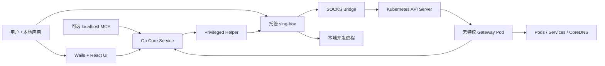
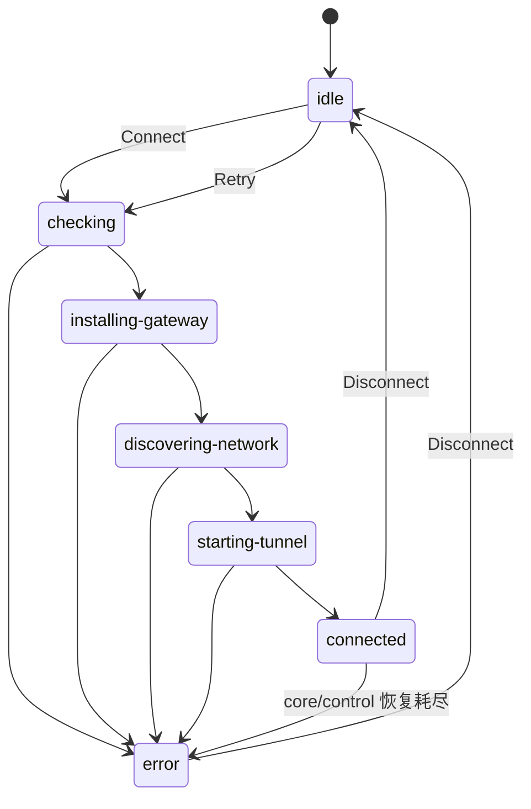

# KubeLoop 系统设计

[English](design.md) | [简体中文](design.zh-CN.md)

> 状态：KubeLoop v1.5.0 已实现基线
> 读者：贡献者、评审者、运维人员和集成方

## 1. 目标

KubeLoop 是面向 Kubernetes 开发的跨平台桌面网络客户端。它让工作站一次连接一个集群，
使普通本地应用无需单独配置代理即可访问 Pod IP、ClusterIP Service 和集群 DNS。

设计遵循六项原则：

1. **只接管集群流量。** 公网及无关私网流量继续使用工作站原有网络。
2. **不暴露集群公网入口。** 数据面通过 Kubernetes API Server port-forward 访问集群内 Gateway。
3. **最小权限。** kubeconfig 凭证留在桌面进程；系统网络交给受限的特权 Helper；Gateway 无特权。
4. **资源变更事务化。** Exchange、Service Mirror、Preview 要么发布完整 runtime，要么回滚此前所有变更。
5. **资源归属可恢复。** 进程、监听、路由、DNS 规则、Gateway 注册和 Kubernetes 资源都有唯一生命周期所有者。
6. **诊断可解释。** UI 明确区分实际测试的路径和仅用于解释的拓扑。

## 2. 产品模型

### 2.1 用户能力

| 能力 | 效果 |
| --- | --- |
| 集群连接 | 通过 TUN 透明访问 Pod、Service 和集群 DNS |
| Port Forward | 将 Pod 或 Service 端口暴露为本地 TCP/UDP 监听 |
| Exchange | 用本地进程替换现有 Service 后端 |
| Service Mirror | 接管现有 Service，保留原始 Pod 作为 Primary，并将请求复制给本地进程 |
| Preview | 创建由本地进程提供服务的临时 ClusterIP Service |
| Session 诊断 | 测试活动 TCP Session 并定位失败诊断层 |
| MCP | 可选地通过 localhost Streamable HTTP 控制同一个应用后端 |

桌面 UI、MCP Server 和持久化意图恢复都调用同一组 Go Manager；它们只是不同控制面，
不是相互独立的实现。

### 2.2 非目标

KubeLoop 不是：

- 通用 VPN 或公网代理；
- Service Mesh 身份模拟器；
- 具备完整 ping 语义的 ICMP 隧道；
- 多集群并发路由器；
- 应用层健康检查替代品；
- 绕过 Kubernetes RBAC 的工具。

系统支持 UDP 传输，但不提供通用 UDP 连通性测试，因为健康检查需要协议专用请求和响应。

## 3. 系统上下文



系统包含四个信任边界：

- **UI 边界：** React 只接收可展示状态并调用类型化 Wails binding，不接收原始 kubeconfig 凭证。
- **桌面边界：** Go 进程持有 Kubernetes client、Session 状态、功能 registry、持久化和 Gateway 协议。
- **特权边界：** Helper 只接受经过认证、字段受限的 Session 描述，不接受命令或调用方指定路径。
- **集群边界：** Gateway 没有 ServiceAccount token、`hostNetwork`、`privileged` 或 `NET_ADMIN`，
  也不通过 Service 或 Ingress 暴露。

## 4. 组件职责

| 组件 | 所有权 |
| --- | --- |
| React UI | 交互、本地化、渲染和客户端异步状态 |
| Application binding | 基于相同后端契约的 Wails 与 MCP 薄适配层 |
| `session.Manager` | 单个集群生命周期、发布状态、发现、指标和恢复 |
| `client/portforward.Manager` | 本地监听和活动 Port Forward runtime |
| `intercept.Manager` | Exchange/Service Mirror/Preview registry、control session 和 host route |
| Cluster provider | kubeconfig、RBAC 探测、inventory、Gateway 和 Service 变更 |
| Privileged Helper | sing-box 进程、TUN、路由、split DNS 和受保护恢复状态 |
| sing-box | 固定 inbound、策略路由、本地/集群 outbound 和核心指标 |
| SOCKS Bridge | 将 `kubernetes-out` 适配为 Gateway 隧道协议 |
| Gateway | 集群侧拨号、反向监听和 TCP/UDP 中继 |
| Store | Context 偏好、手工网络信息、别名和恢复意图 |

高频指标和 inventory 更新通过 state hub 发布，避免与连接生命周期锁竞争。

## 5. 集群连接生命周期

### 5.1 状态机



任意时刻只允许一个 run。`Connect` 在启动异步工作前安装 cancel function 和 completion
channel；`Disconnect` 取消该 run，并在有界超时内等待清理。只有所有 runtime 资源关闭后
才能发布 Idle。

### 5.2 启动顺序

1. 探测所选 Context 和有效 RBAC capability。
2. 安装/升级 Gateway，或复用管理员预装的 Gateway。
3. 发现 Pod route、Service route、DNS、Kubernetes 版本和权限范围内的 inventory，并合并手工配置。
4. 建立到 Gateway 的 API Server port-forward。
5. 启动 Gateway control channel。
6. 启动本地 SOCKS Bridge 并安装 host-route handler。
7. 请求 Helper 生成并启动 sing-box Session。
8. 校验固定 feature inbound，绑定各功能 traffic dialer。
9. 发布 Connected，探测集群 DNS，恢复持久化功能，并启动 inventory 与 metrics loop。

`sessionRuntime` 按创建顺序记录资源，按相反顺序关闭。清理是幂等的，因此启动失败、显式
断开和应用退出可以安全汇合。

### 5.3 Connected loop 恢复

Connected loop 处理取消、sing-box 退出、Gateway control 丢失和指标 tick。恢复首先重连
当前 Gateway；后续尝试可寻找替代 Gateway Pod、建立新 API port-forward、更新 SOCKS
Bridge 地址并重新注册活动监听。

control generation 单调递增，用于拒绝过期恢复结果。五次有界尝试仍失败后进入 Error，
不会让部分可用的数据面静默运行。

## 6. 网络发现与透明数据通路

### 6.1 发现

Cluster provider 获取：

- 来自 Node 和已观察 Pod 的 Pod CIDR；
- 可获得时使用 Service CIDR，否则使用精确 Service IP route；
- 集群 DNS server 和 search domain；
- cluster-wide 或限定 Namespace 的 inventory；
- 只禁用受影响功能的 capability issue。

受限 RBAC 用户可按 Context 保存 Pod CIDR、Service CIDR、DNS server、DNS Namespace、
cluster domain 和 host alias。手工值经过校验后与发现结果合并。

TUN 启动前会比较集群 route 与本地 interface、VPN、Docker/VM 网络和默认路由，明确展示冲突。

### 6.2 透明流量

```text
本地应用
  → 平台 TUN
  → sing-box tun-in
  → kubernetes-out
  → 本地 SOCKS Bridge
  → Kubernetes API Server port-forward
  → Gateway
  → Pod / Service / CoreDNS
```

sing-box 只为集群目标安装固定 route。集群流量进入 `kubernetes-out`，无关流量保持
`direct-out`。最终连接由 Gateway 在集群内建立，因此目标看到的是集群侧流量。

### 6.3 DNS

Helper 为配置的集群域名安装平台对应的 split DNS。查询进入 `dns-in`，通过 Bridge 和
Gateway 到达 CoreDNS；公网 DNS 继续使用操作系统正常 resolver。

平台 adapter 包含全部 route 和 DNS 变更逻辑。通用 Session 代码只处理已校验的网络描述和清理契约。

## 7. 统一功能数据面

每个集群 Session 只创建一次固定 feature inbound；单个 mapping 的创建和停止不会重启 sing-box。

| Inbound/user | 目标类型 | 功能 |
| --- | --- | --- |
| `traffic-in` / `port-forward` | 经 `kubernetes-out` 到集群 | Port Forward |
| `traffic-in` / `exchange` | 经 `local-out` 到授权本地目标 | Exchange |
| `traffic-in` / `preview` | 经 `local-out` 到授权本地目标 | Preview |
| `traffic-in` / `mirror-shadow` | 经 `local-out` 到授权本地目标 | Service Mirror Shadow |

共享 inbound 只监听 loopback，使用 Session 随机密码，并把 SOCKS username 作为功能染色。
未知用户、本地类功能访问集群目标以及非法目标组合都会被拒绝。

协议适配、路由规则、背压和 UDP association 详见
[统一流量数据面设计](singbox-traffic-dataplane.zh-CN.md)。

## 8. 功能 Session

### 8.1 Port Forward

Port Forward 把 Pod 或 Service 端口暴露为本地监听。集群 Session 已连接时，功能流量以
`port-forward` 身份进入 sing-box，再经 Gateway 到达集群。成功启动后才持久化，成功停止后才删除意图。

### 8.2 Exchange

Exchange 改写现有 ClusterIP Service：

1. 预留 `namespace/service`，注册 Gateway 反向监听端口。
2. 快照 selector、classic Endpoints 和 EndpointSlices。
3. 清空 selector，安装指向 Gateway 的托管 EndpointSlice。
4. 将反向流量路由到配置的本地目标。
5. 停止时恢复快照并注销监听。

集群客户端继续使用原 ClusterIP 和 DNS 名称。

### 8.3 Preview

Preview 创建新的无 selector ClusterIP Service 和指向 Gateway 监听的托管 EndpointSlice。
停止时删除创建的资源和 host route，不修改已有 Service。

### 8.4 Service Mirror

Service Mirror 的操作对象是一个现有 Kubernetes Service。它复用 Exchange 的 Service
接管点和资源快照，然后把每个请求拆分为两条路径：

- **Primary：** Gateway 连接拦截前快照中的原始 Pod，并把响应返回集群客户端。
- **Shadow：** 请求数据复制给本地进程，其响应被丢弃。

Shadow 失败、变慢、断开或缓冲区压力都不能中断 Primary。

### 8.5 事务式启动与停止

Exchange、Service Mirror、Preview 启动流程：

1. 快照 control generation 并预留 feature key；
2. 校验目标并注册 Gateway 端口；
3. 应用 Kubernetes 变更；
4. 安装 host route 并构造 runtime；
5. 仅在生命周期快照仍有效时发布；
6. commit 后才持久化。

deferred compensation 按相反顺序撤销已完成阶段。停止失败时保留 runtime 和恢复意图，
允许重试；不能因为部分清理成功就报告已停止。

## 9. 活动 Session 诊断

Network 页面展示活动 Session，并提供 TCP 连通性测试。

| Session | 探测 | 失败层 |
| --- | --- | --- |
| Port Forward | 连接活动本地监听 | `local-listener` |
| Exchange/Service Mirror/Preview | 检查 control ready 和端口注册，再连接每个 TCP 本地目标 | `gateway-control`、`local-target` |

结果弹窗展示完整拓扑，但实际测试和仅拓扑线段使用不同视觉状态。
Exchange/Service Mirror/Preview 测试不会创建集群工作负载、通过 Service 发送应用层负载，或验证业务
响应语义。“重新测试”只会在当前测试完成后对同一个 Session 目标再次执行。

## 10. 持久化与失败语义

持久化内容包括 Context 选择、手工网络设置、host alias、UI 偏好、上次连接标记和功能恢复意图。

必须满足：

- 启动取消回到 Idle，并允许立即重连；
- 依赖数据面关闭前先恢复 Kubernetes 资源；
- 恢复后的 control ready 前先重新注册活动 Gateway 监听；
- sing-box 启动遇到本地 control/DNS 端口冲突时使用新端口有界重试；
- 失败路径不能静默绕过 sing-box 或改变流量策略；
- shutdown 保留下一次启动所需的恢复意图；
- 显式 disconnect 在清理后清除 connected 标记。

## 11. 安全与权限

### 11.1 本地安全

- kubeconfig 凭证留在 Go 桌面进程；
- Helper IPC 认证调用方并校验每个字段；
- Helper 状态和生成配置位于受保护系统目录；
- feature inbound 和 MCP 只绑定 `127.0.0.1`；
- MCP 默认关闭，可选启用 Bearer 认证；
- 日志脱敏 kubeconfig、token、证书和 Secret。

### 11.2 集群安全

Gateway 是拨号器和反向监听中继，不是 Kubernetes controller。所有 Kubernetes 读取和变更
都使用用户桌面 kubeconfig。

| 权限 | 缺失时的行为 |
| --- | --- |
| Gateway 安装/更新 | 要求管理员预装 Gateway |
| Gateway Pod port-forward | 无法建立连接 |
| Node/CoreDNS/cluster-wide inventory | 使用限定范围发现和手工网络值 |
| Service/Endpoints/EndpointSlice 写入 | 禁用 Exchange、Service Mirror、Preview |
| Namespace inventory | 选择和 watch 限于授权 Namespace |

Release 固定 Gateway 镜像版本，不需要 NodePort、LoadBalancer、Ingress、host network、
privileged container 或挂载 ServiceAccount token。

## 12. 可观测性

发布状态包含 phase、可读消息、capability、discovery、网络问题、inventory revision、版本、
活动连接和时间戳。指标合并 sing-box snapshot 与功能语义 traffic tracking。

UI 展示：

- 连接时长和当前 phase；
- 上下行、活动 TCP/UDP 连接和近期流量；
- Pod/Service/DNS 发现和冲突诊断；
- 活动功能 Session；
- 连通性测试结果、错误和失败层；
- 脱敏结构化日志及生成的 sing-box 配置。

默认诊断输出不包含流量 payload、Kubernetes Secret 或原始 kubeconfig。

## 13. 跨平台与发布

Go control plane、React UI、Gateway 协议和 feature manager 在三平台共享。只有 Helper 安装、
进程监管、TUN、route、DNS、打包和平台测试因操作系统而异。

| 平台 | 产物 |
| --- | --- |
| macOS | amd64/arm64 DMG、tar.gz 和 Homebrew Cask |
| Windows | amd64/arm64 NSIS installer 和 portable zip |
| Linux | amd64/arm64 deb、rpm 和 tar.gz |

Release tag 构建桌面产物、Gateway binary、多架构 Gateway image 和 `SHA256SUMS`。安装包内包含
固定版本 sing-box 和平台 Helper。

## 14. 验证标准

Release 必须满足：

1. Pod IP、ClusterIP 和集群 DNS 无需单独配置应用即可访问。
2. 非集群流量保持原有路由。
3. Connect/disconnect 和启动取消不遗留 TUN、route、DNS、进程、监听或 Kubernetes 资源。
4. Exchange 精确恢复原 Service 资源。
5. Preview 删除自己创建的全部资源。
6. Shadow 失败或缓慢时 Service Mirror Primary 仍保持正确。
7. TCP/UDP 功能数据通路符合本文语义。
8. TCP 诊断报告正确失败层，不把未测试拓扑宣称为成功。
9. 受限 RBAC 返回可执行的 capability 错误并安全降级。
10. unit、race、跨平台 build 和 E2E suite 全部通过。

## 15. 相关文档

- [统一流量数据面设计](singbox-traffic-dataplane.zh-CN.md)
- [产品网站架构页](../site/architecture.html)
- [English README](../README.md)
- [简体中文 README](../README_zh-CN.md)
