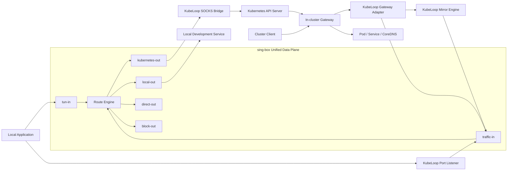
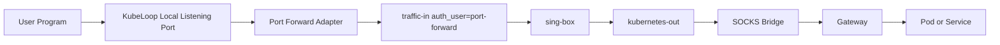
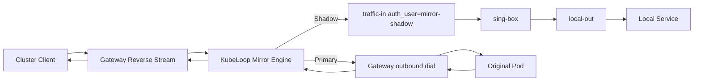

# Unified Traffic Data Plane Design Based on sing-box

## 1. Background

KubeLoop currently uses sing-box to provide TUN, cluster DNS, and rule-based routing
capabilities. When the local machine accesses a Pod IP, Service ClusterIP, or cluster
domain name, traffic follows this path:

```text
Local application → TUN → sing-box → SOCKS Bridge → API Server port-forward → Gateway → Cluster target
```

Port Forward, Exchange, Preview, and Mirror currently also include data forwarding
paths managed directly by KubeLoop. From a connection-model perspective, all of these
features can be expressed as:

```text
inbound → route → outbound
```

sing-box can therefore be elevated from a network core serving only TUN traffic to a
unified TCP/UDP data plane. KubeLoop remains responsible for Kubernetes and Gateway
control protocols, resource changes, and Mirror traffic splitting; these control
capabilities are not delegated to sing-box.

## 2. Design Goals

The goals of this design are:

1. Route regular cluster access and business data for Port Forward, Exchange, Preview,
   and Mirror uniformly through sing-box.
2. Distinguish traffic types and apply routing by using inbound and outbound tags.
3. Avoid restarting or reloading sing-box when a business feature is created or
   stopped.
4. Preserve KubeLoop's control over Kubernetes resources and Gateway protocols.
5. Support TCP, UDP, TCP half-close, timeouts, and connection cancellation.
6. Ensure that failures or blocking in a local Mirror replica do not affect the
   primary service path.
7. Prevent traffic loops among the local machine, TUN, Gateway, and SOCKS Bridge.
8. Provide a unified data source for feature-level and mapping-level traffic metrics.

## 3. Non-Goals

This design does not require:

- sing-box to understand the Kubernetes API, SPDY, WebSocket, or
  `pods/portforward` protocol;
- sing-box to manage Services, EndpointSlices, or the Gateway Deployment;
- sing-box to implement the Gateway Register, InboundReady, or Accept control
  protocols;
- standard sing-box routing rules to implement one-to-two traffic replication for
  Mirror;
- immediate removal of the existing Kubernetes API port-forward compatibility path
  in the first phase;
- interception of public internet traffic or introduction of proxy subscriptions.

## 4. Overall Architecture



Component responsibilities are as follows:

| Component | Responsibility |
| --- | --- |
| KubeLoop Core | Control plane, feature lifecycle, persistence, target resolution, and business state |
| Traffic Adapter | Protocol adaptation between TCP/UDP and SOCKS5 |
| Mirror Engine | Traffic replication and isolation between the primary path and local replica |
| sing-box | TCP/UDP inbounds, rule-based routing, outbounds, and connection-level metrics |
| SOCKS Bridge | Converts `kubernetes-out` traffic to the Gateway tunnel protocol |
| Gateway | In-cluster target connections, reverse listeners, and data relay |

## 5. sing-box Inbound Design

### 5.1 Fixed Inbounds

The following inbounds are created once when a Session starts:

| Inbound tag | Type | Purpose |
| --- | --- | --- |
| `tun-in` | TUN | Regular Pod, Service, and cluster DNS access |
| `traffic-in` | SOCKS5 | All feature adapters (Port Forward, Exchange, Preview, Mirror) |
| `dns-in` | Direct | Local split DNS entry point |

`traffic-in` registers four SOCKS users. The username is the feature dye
(`auth_user`) used by route rules. Mirror primary does **not** use
`traffic-in`; it dials the original Pod through the Gateway control/data plane.

| Username (`auth_user`) | Route class |
| --- | --- |
| `port-forward` | cluster → `kubernetes-out` |
| `exchange` | local (anti-loop) → `local-out` |
| `preview` | local (anti-loop) → `local-out` |
| `mirror-shadow` | local (anti-loop) → `local-out` |

Except for TUN, business inbounds:

- listen only on `127.0.0.1`;
- use a random port assigned by the operating system;
- use a session-random password (usernames are fixed feature dyes);
- are not exposed to the LAN or public internet;
- remain unchanged when an individual business mapping is created or stopped.

### 5.2 Why Dynamic Direct Inbounds Are Not Used

The sing-box Direct inbound is well suited to fixed-target port forwarding, but each
mapping requires an independent listening address and target address. KubeLoop
currently hosts sing-box as a separate process. If adding a mapping required
regenerating the configuration and restarting or reloading the process, it would
introduce:

- disruption of existing TUN and business connections;
- complex rollback after a dynamic configuration failure;
- process lifecycle differences across platforms;
- coupling between UI operations and restarts of the underlying core.

A fixed SOCKS5 inbound can carry a dynamic target address in its handshake. Adding a
mapping therefore updates only KubeLoop's business state and does not modify the
sing-box configuration.

## 6. sing-box Outbound Design

| Outbound tag | Type | Purpose |
| --- | --- | --- |
| `kubernetes-out` | SOCKS5 | Sends traffic to the local SOCKS Bridge and then into the Gateway |
| `local-out` | Direct | Connects to authorized local development services |
| `direct-out` | Direct | Non-cluster traffic and required internal direct connections |
| `block-out` | Reject | Rejects invalid targets and out-of-scope access |

The basic routing relationships are:

| Match | Outbound |
| --- | --- |
| `traffic-in` + `auth_user` = `port-forward` | `kubernetes-out` |
| `traffic-in` + local users + cluster CIDR | reject (anti-loop) |
| `traffic-in` + local users + loopback/private | `local-out` |
| `traffic-in` + unknown/missing `auth_user` | reject |
| `tun-in` + cluster CIDR/domain | `kubernetes-out` |
| `tun-in` + non-cluster target | `direct-out` |
| Any invalid combination | `block-out` |

Routing matches `traffic-in` plus `auth_user` (feature dye), then validates the
target range for local-class users. Choosing an outbound based only on the target
IP cannot safely merge cluster-bound and local-bound features onto one port.

## 7. Unified Traffic Adapter

KubeLoop introduces a unified Traffic Adapter abstraction for injecting business
connections into fixed SOCKS5 inbounds.

Its conceptual interfaces include:

```text
TCP stream → SOCKS5 CONNECT
UDP frames → SOCKS5 UDP association
```

Each adaptation carries at least:

```text
Feature       port-forward | exchange | preview | mirror-shadow
              (= SOCKS username / auth_user dye; Mirror primary uses Gateway dial)
MappingID     Feature mapping ID
Inbound       traffic-in (shared listen)
Network       tcp | udp
TargetHost    Final target host
TargetPort    Final target port
Timeout       Connection and idle timeouts
```

The Traffic Adapter handles uniformly:

- SOCKS5 negotiation and authentication (feature username + session password);
- bidirectional TCP copying;
- TCP half-close;
- UDP datagram encapsulation and association lifecycle;
- Context cancellation;
- connection and idle timeouts;
- byte counts, duration, and close reasons;
- structured error conversion.

The features no longer implement their own local direct-connection logic. They
are responsible only for determining the feature dye and target.

## 8. Port Forward

### 8.1 Data Path



The KubeLoop Port Listener remains responsible for:

- the local port selected by the user;
- creating, stopping, and persisting mappings;
- accepting TCP connections or UDP data;
- converting a fixed target into a SOCKS5 request;
- associating each connection with a specific Mapping ID.

### 8.2 Target Selection

Pod Port Forward:

```text
TargetHost = Pod IP
TargetPort = Pod/container port
```

Service Port Forward preferably uses:

```text
TargetHost = Service ClusterIP
TargetPort = Service port
```

This allows kube-proxy or the cluster data plane to select a backend, avoiding the
need to pin a specific Pod in advance on the desktop. Special cases such as Headless
Services, ExternalName Services, and Services without a ClusterIP require separate
resolution or fallback to a Pod target.

### 8.3 Relationship to the Existing API port-forward

The first phase retains two modes:

| State | Data path |
| --- | --- |
| Primary Session connected | sing-box → Gateway |
| Primary Session disconnected | Existing Kubernetes API `pods/portforward` |

In the long term, the product must choose among:

1. Retain compatibility mode so Port Forward can operate independently of the primary
   Session;
2. Require Port Forward to use a connected Session;
3. Automatically start a lightweight data Session without enabling TUN.

Compatibility mode is recommended for the first phase to avoid changing existing
feature semantics.

## 9. Exchange

### 9.1 Data Path

```text
Cluster client
  → Original Service ClusterIP
  → Gateway listener
  → InboundReady
  → KubeLoop Accept
  → Exchange Adapter
  → traffic-in (auth_user=exchange)
  → sing-box
  → local-out
  → LocalHost:LocalPort
```

KubeLoop no longer connects directly to the local target. Instead, it submits the
target to `traffic-in` as a SOCKS5 CONNECT or UDP association request dyed with
`auth_user=exchange`.

### 9.2 Failure Semantics

- If the local TCP target connection fails, close the Gateway stream so that the
  cluster client receives a failure or reset.
- If the local UDP target is unavailable, terminate the corresponding association
  and record the error.
- If the local service closes while a connection is active, terminate the Gateway
  stream accordingly.
- Exchange does not automatically fall back to the original Pod because its semantics
  are to replace the original Service backend completely.

## 10. Preview

Preview uses the same reverse data model as Exchange:

```text
Preview Service
  → Gateway listener
  → KubeLoop Accept
  → Preview Adapter
  → traffic-in (auth_user=preview)
  → sing-box
  → local-out
  → LocalHost:LocalPort
```

Preview shares `traffic-in` with Exchange but uses a dedicated `auth_user=preview`
dye to enable:

- independent connection-count and traffic metrics;
- different timeout, rate-limit, or access policies;
- differentiation from Exchange in the UI and diagnostic logs;
- additional protection for temporary preview services in the future.

## 11. Mirror

### 11.1 Data Path

A standard sing-box route action selects only one outbound and therefore cannot
directly perform one-to-two traffic replication. The Mirror Engine remains in
KubeLoop: Primary dials the original Pod through the Gateway, while Shadow is
injected into sing-box `traffic-in` (`auth_user=mirror-shadow`).



Only the Primary response is returned to the cluster client. Shadow responses must
be continuously read and discarded to prevent writes by the local service from
blocking.

### 11.2 Isolation and Backpressure

Mirror must follow:

```text
Primary: reliable writes; backpressure is allowed
Shadow: best-effort writes; backpressure must not propagate to Primary
```

Each Shadow connection should have:

- a bounded in-memory buffer;
- a maximum number of queued bytes;
- a connection timeout;
- a write timeout;
- a maximum idle time;
- a counter for drops caused by limits;
- replication terminated after a local target failure, while Primary remains active.

The following Shadow failures must not affect Primary:

- the local port is not listening;
- the local service responds slowly;
- the Shadow buffer is full;
- the local service disconnects while active;
- the sing-box `traffic-in` path for `auth_user=mirror-shadow` is temporarily unavailable.

A Primary connection or transmission failure must terminate the client connection,
because Primary is the source of the business response.

### 11.3 UDP Mirror

UDP Mirror must maintain independent state for each Gateway stream or client session:

- the Primary association handles requests and responses;
- the Shadow association replicates requests only;
- Shadow responses are read and discarded;
- a Shadow timeout does not close Primary;
- associations must have an idle-reclamation mechanism;
- each datagram is subject to a maximum length.

## 12. Security Boundaries

### 12.1 Local Inbound Protection

- All SOCKS5 inbounds bind only to loopback.
- Each Session generates independent random authentication credentials.
- Credentials exist only in restricted configuration and KubeLoop memory.
- Credentials become invalid immediately after the Session stops.
- The Control Plane Secret is separate from the SOCKS authentication credentials.

### 12.2 `local-out` Target Restrictions

Allowed by default:

- `127.0.0.0/8`;
- `::1`.

Allowed with explicit user authorization:

- local network-interface addresses;
- specified LAN IPs or CIDRs.

Rejected by default:

- public internet addresses;
- the current cluster's Pod CIDR;
- the current cluster's Service CIDR;
- Gateway port-forward addresses;
- sing-box's own inbounds;
- Control Plane, DNS, and SOCKS Bridge ports.

### 12.3 `kubernetes-out` Target Restrictions

Only the following are allowed:

- the current cluster's Pod CIDR;
- the current cluster's Service CIDR;
- discovered exact Pod IPs and Service IPs;
- cluster DNS;
- user-configured cluster networks.

The Gateway continues to validate private cluster targets, providing protection on
both the desktop and cluster sides.

### 12.4 Loop Detection

The following cases must be rejected when starting a Session or creating a mapping:

- `local-out` points to a cluster CIDR;
- a local target equals any sing-box inbound;
- a local target equals the SOCKS Bridge;
- the Port Forward local listening port equals an internal port;
- a Host Alias resolves a local domain name to an internal control port;
- Mirror Primary is incorrectly routed through `traffic-in` / `local-out` instead of Gateway dial.

## 13. Lifecycle

### 13.1 Session Startup

```text
1. Check Kubernetes permissions and the cluster network
2. Install or reuse the Gateway
3. Establish the Gateway API Server port-forward
4. Start the SOCKS Bridge
5. Allocate fixed inbound ports and random authentication credentials
6. Generate and start sing-box
7. Verify the fixed inbounds and Control Plane
8. Start the Gateway control channel
9. Restore persisted Exchange, Preview, Mirror, and Port Forward mappings
10. Start accepting new business connections
```

### 13.2 Creating a Business Mapping

```text
1. Validate the target and permissions
2. Write Kubernetes resources or register a Gateway listener
3. Save the feature, inbound, target, and policy
4. Publish the business-ready state
5. Forward new connections through the corresponding fixed inbound
```

Neither creating nor stopping a mapping modifies the sing-box configuration.

### 13.3 Stopping a Business Mapping

```text
1. Stop accepting new connections
2. Unregister the Gateway listener
3. Restore or delete Kubernetes resources
4. Allow existing connections a short time to drain
5. Close remaining connections
6. Delete runtime and persisted state
```

### 13.4 Session Shutdown

```text
1. Mark the Session as stopping
2. Stop accepting new business connections
3. Unregister all Gateway listeners
4. Restore Exchange Services and EndpointSlices
5. Delete Preview Services and EndpointSlices
6. Allow connections to drain, then close the remainder
7. Stop sing-box
8. Stop the SOCKS Bridge
9. Close the Gateway port-forward
10. Clean up TUN, routes, and split DNS
```

Kubernetes resources should be restored before the data plane shuts down to reduce
the likelihood of traffic black holes for Exchange and Preview.

## 14. Failure Handling

| Failure | Handling |
| --- | --- |
| sing-box is not running | Reject creation of features that depend on the unified data plane |
| A fixed inbound is unavailable | Put the Session into an error state; do not silently connect directly |
| `kubernetes-out` fails | Terminate the corresponding connection and record the Gateway/Bridge error |
| `local-out` fails | Exchange/Preview fails; Mirror stops only the Shadow branch |
| Gateway control channel disconnects | Stop new reverse connections and trigger Session reconnection or failure |
| Gateway data channel disconnects | Close the associated stream; do not replay TCP data indefinitely |
| UDP association times out | Reclaim the association without affecting other sessions |
| Mirror Shadow buffer is full | Drop and count Shadow data while keeping Primary active |

The system must not silently switch to a local direct connection after the sing-box
path fails, because doing so would invalidate traffic policies, metrics, and security
boundaries. The legacy API Server compatibility mode for Port Forward is an explicit
choice, not a silent fallback.

## 15. Observability

sing-box provides basic inbound, outbound, connection, and byte-level information.
The KubeLoop Traffic Adapter supplements it with business semantics.

Each connection should record:

```text
feature
mapping_id
inbound
outbound
network
source
destination
opened_at
closed_at
upload_bytes
download_bytes
duration
close_reason
error_stage
```

`error_stage` distinguishes at least:

```text
listen
gateway-accept
socks-auth
socks-connect
route
local-dial
gateway-dial
relay
timeout
cancel
```

Mirror additionally records:

```text
shadow_connect_errors
shadow_dropped_bytes
shadow_buffer_overflows
shadow_active_connections
primary_errors
```

The UI can aggregate by feature, mapping, inbound, and outbound instead of showing
only total TUN traffic.

## 16. Migration Plan

### Phase 1: Unified Adaptation Foundation

- Add fixed SOCKS5 inbounds to the sing-box configuration.
- Establish a unified TCP/UDP Traffic Adapter.
- Add inbound health checks, authentication, and loop detection.
- Establish feature-level and mapping-level metrics.
- Do not change the external behavior of Exchange, Preview, or Mirror yet.

### Phase 2: Port Forward

- When the primary Session is connected, use
  `traffic-in` (`auth_user=port-forward`) → `kubernetes-out`.
- Retain the Kubernetes API port-forward when disconnected.
- Compare TCP, UDP, latency, and error semantics between the two paths.
- Decide explicitly whether to retain compatibility mode in the long term.

### Phase 3: Exchange and Preview

- Replace direct local connections with the corresponding Traffic Adapter.
- Dye Exchange/Preview with distinct `auth_user` values on shared `traffic-in`.
- Verify TCP half-close and UDP association behavior.
- Ensure that creating and stopping mappings does not restart sing-box.
- Add security restrictions for local targets.

### Phase 4: Mirror

- Dial Primary through the Gateway (`dialGatewayOpen`).
- Connect Shadow with `auth_user=mirror-shadow` on `traffic-in`.
- Introduce a bounded asynchronous Shadow buffer.
- Verify that Shadow failures have no effect on Primary.

### Phase 5: Consolidation

- Present the four traffic-in feature dyes uniformly in the UI.
- Remove unnecessary business direct-connection branches.
- Improve diagnostic bundles, route-match information, and error stages.
- Decide whether to remove the legacy Port Forward data path based on compatibility.

## 17. Acceptance Criteria

### 17.1 General

- Creating or stopping any mapping does not restart sing-box.
- Every business connection type reports the correct inbound and outbound.
- Invalid targets are explicitly rejected with a structured error.
- TCP half-close behaves correctly.
- UDP associations are reclaimed after their timeout.
- No listening ports, TUN interfaces, routes, or DNS configuration remain after a
  Session stops.

### 17.2 Port Forward

- TCP forwarding succeeds for Pods and Services.
- UDP forwarding succeeds for Pods and Services.
- Both specified and automatically assigned local ports work.
- Business data uses `traffic-in` (`auth_user=port-forward`) when the primary Session is connected.
- When disconnected, the compatibility path behaves as it does currently.

### 17.3 Exchange

- Requests reach the local service when the original Service is accessed from within
  the cluster.
- Responses from the local service are returned correctly to the cluster client.
- A clear failure is returned when the local service is unavailable.
- The Service selector and EndpointSlice are restored correctly after Exchange stops.

### 17.4 Preview

- A newly created Service can access the local service from within the cluster.
- The Service and EndpointSlice are deleted after Preview stops.
- Metrics and logs distinguish Preview from Exchange.

### 17.5 Mirror

- Primary requests and responses remain complete.
- Shadow receives the same request data as Primary.
- Shadow responses are not sent to the cluster client.
- Primary is unaffected when Shadow is not listening, responds slowly, disconnects,
  or has a full buffer.
- Both TCP and UDP satisfy the semantics above.

## 18. Final Boundaries

The unified responsibilities can be summarized as:

```text
KubeLoop = Control plane + Kubernetes/Gateway protocol adaptation + Mirror tee
sing-box = Unified TCP/UDP data plane + inbound/outbound routing + basic metrics
Gateway  = Cluster-side ingress, egress, and reverse listeners
```

All business data should pass through sing-box, while the Kubernetes API, Gateway
control protocols, and Mirror traffic splitting remain managed by KubeLoop. This
provides unified data-plane routing and observability without assigning Kubernetes
control responsibilities to sing-box that it is not suited to handle.
