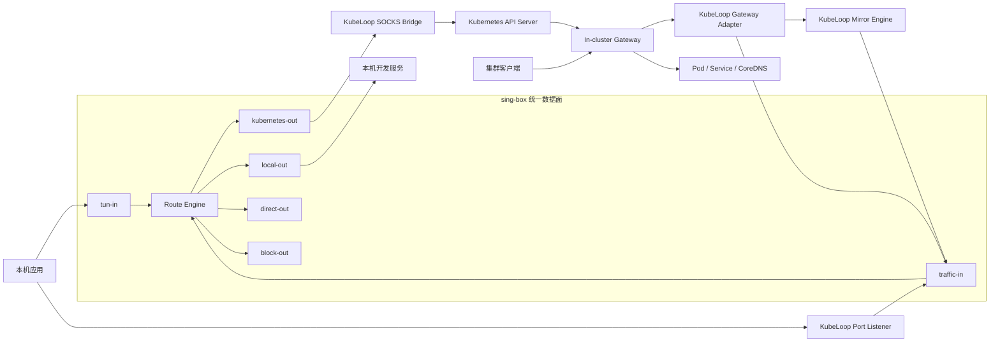
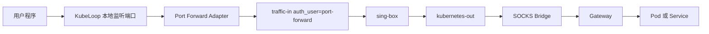
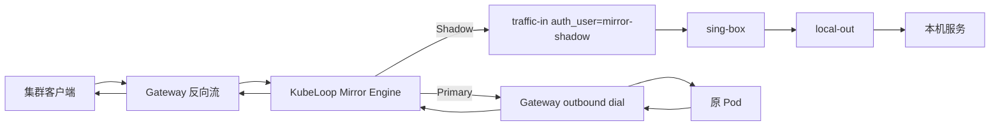

# 基于 sing-box 的统一流量数据面设计

## 1. 背景

KubeLoop 当前使用 sing-box 提供 TUN、集群 DNS 和规则路由能力。本机访问 Pod IP、
Service ClusterIP 或集群域名时，流量经过以下路径：

```text
本机应用 → TUN → sing-box → SOCKS Bridge → API Server port-forward → Gateway → 集群目标
```

Port Forward、Exchange、Preview 和 Mirror 目前还包含由 KubeLoop 直接管理的数据转发路径。
从连接模型看，这些功能都可以表达为：

```text
inbound → route → outbound
```

因此可以将 sing-box 从“仅服务 TUN 的网络内核”提升为统一的 TCP/UDP 数据面。KubeLoop
继续负责 Kubernetes 和 Gateway 控制协议、资源变更以及 Mirror 分流，不把这些控制能力
下沉到 sing-box。

## 2. 设计目标

本方案的目标是：

1. 普通集群访问、Port Forward、Exchange、Preview 和 Mirror 的业务数据统一经过 sing-box。
2. 使用 inbound tag 和 outbound tag 区分流量类型并执行路由。
3. 创建或停止业务功能时不重启、不重载 sing-box。
4. 保留 KubeLoop 对 Kubernetes 资源和 Gateway 协议的控制。
5. 同时支持 TCP、UDP、TCP half-close、超时和连接取消。
6. Mirror 本机副本故障或阻塞时不得影响原服务主路径。
7. 防止本机、TUN、Gateway 和 SOCKS Bridge 之间形成流量循环。
8. 为功能级和映射级流量统计提供统一数据来源。

## 3. 非目标

本方案不要求：

- sing-box 理解 Kubernetes API、SPDY、WebSocket 或 `pods/portforward` 协议；
- sing-box 管理 Service、EndpointSlice 或 Gateway Deployment；
- sing-box 实现 Gateway 的 Register、InboundReady 和 Accept 控制协议；
- 使用 sing-box 普通路由规则完成 Mirror 的一进两出复制；
- 第一阶段立即删除现有 Kubernetes API port-forward 兼容路径；
- 接管公网流量或引入代理订阅。

## 4. 总体架构



组件职责如下：

| 组件 | 职责 |
| --- | --- |
| KubeLoop Core | 控制面、功能生命周期、持久化、目标解析和业务状态 |
| Traffic Adapter | TCP/UDP 与 SOCKS5 之间的协议适配 |
| Mirror Engine | 主路径与本机副本的流量复制和隔离 |
| sing-box | TCP/UDP 入站、规则路由、出站、连接级指标 |
| SOCKS Bridge | 将 `kubernetes-out` 转换为 Gateway 隧道协议 |
| Gateway | 集群内连接目标、反向监听和数据中继 |

## 5. sing-box 入站设计

### 5.1 固定入站

Session 启动时一次性创建以下入站：

| Inbound tag | 类型 | 用途 |
| --- | --- | --- |
| `tun-in` | TUN | 普通 Pod、Service 和集群 DNS 访问 |
| `traffic-in` | SOCKS5 | 全部 feature 适配器（Port Forward / Exchange / Preview / Mirror） |
| `dns-in` | Direct | 本地 split DNS 入口 |

`traffic-in` 注册四个 SOCKS 用户；用户名即 feature 染色（`auth_user`），供路由规则匹配。
Mirror primary **不**走 `traffic-in`，而是通过 Gateway 拨回原 Pod。

| Username（`auth_user`） | 路由类 |
| --- | --- |
| `port-forward` | cluster → `kubernetes-out` |
| `exchange` | local（反环）→ `local-out` |
| `preview` | local（反环）→ `local-out` |
| `mirror-shadow` | local（反环）→ `local-out` |

除 TUN 外，业务入站：

- 只监听 `127.0.0.1`；
- 使用系统分配的随机端口；
- 密码为 Session 随机 secret（用户名为固定 feature 染料）；
- 不对局域网或公网开放；
- 不因新增或停止一条业务映射而改变。

### 5.2 为什么不使用动态 Direct inbound

sing-box 的 Direct inbound 很适合表达固定目标的端口转发，但每条映射都需要独立监听地址
和目标地址。KubeLoop 当前以独立进程方式托管 sing-box，如果新增映射需要重新生成配置并
重启或重载进程，会带来：

- 已有 TUN 和业务连接中断；
- 动态配置失败后的回滚复杂；
- 不同平台的进程生命周期差异；
- UI 操作与底层核心重启耦合。

固定 SOCKS5 inbound 可以在握手中携带动态目标地址，因此新增映射只更新 KubeLoop 业务
状态，不修改 sing-box 配置。

## 6. sing-box 出站设计

| Outbound tag | 类型 | 用途 |
| --- | --- | --- |
| `kubernetes-out` | SOCKS5 | 发送到本地 SOCKS Bridge，再进入 Gateway |
| `local-out` | Direct | 连接经过授权的本机开发服务 |
| `direct-out` | Direct | 非集群流量和必要的内部直连 |
| `block-out` | Reject | 拒绝非法目标和越界访问 |

基础路由关系：

| 匹配 | Outbound |
| --- | --- |
| `traffic-in` + `auth_user` = `port-forward` | `kubernetes-out` |
| `traffic-in` + local users + 集群 CIDR | reject（反环） |
| `traffic-in` + local users + loopback/private | `local-out` |
| `traffic-in` + 未知/缺失 `auth_user` | reject |
| `tun-in` + 集群 CIDR/域名 | `kubernetes-out` |
| `tun-in` + 非集群目标 | `direct-out` |
| 任意不合法组合 | `block-out` |

路由匹配 `traffic-in` 与 `auth_user`（feature 染色），再对 local 类用户校验目标范围。
不能只根据目标 IP 选择 outbound，否则无法把 cluster 类与 local 类安全合并到同一端口。

## 7. 统一 Traffic Adapter

KubeLoop 内部引入统一的 Traffic Adapter 概念，用于把业务连接注入固定 SOCKS5 inbound。

概念接口包括：

```text
TCP stream → SOCKS5 CONNECT
UDP frames → SOCKS5 UDP association
```

每次适配至少携带：

```text
Feature       port-forward | exchange | preview | mirror-shadow
              (= SOCKS username / auth_user 染料；Mirror primary 走 Gateway dial)
MappingID     功能映射 ID
Inbound       traffic-in（共享 listen）
Network       tcp | udp
TargetHost    最终目标主机
TargetPort    最终目标端口
Timeout       建连与空闲超时
```

Traffic Adapter 统一处理：

- SOCKS5 协商和认证（feature 用户名 + Session 密码）；
- TCP 双向复制；
- TCP half-close；
- UDP 报文封装与 association 生命周期；
- Context 取消；
- 建连和空闲超时；
- 字节数、持续时间和关闭原因；
- 结构化错误转换。

各功能不再分别实现本机直连逻辑，只负责确定 feature 染料和 target。

## 8. Port Forward

### 8.1 数据路径



KubeLoop Port Listener 继续负责：

- 用户选择的本地端口；
- 映射的创建、停止和持久化；
- 接受 TCP 连接或 UDP 数据；
- 将固定目标转换为 SOCKS5 请求；
- 将连接关联到具体 Mapping ID。

### 8.2 目标选择

Pod Port Forward：

```text
TargetHost = Pod IP
TargetPort = Pod/container port
```

Service Port Forward 优先使用：

```text
TargetHost = Service ClusterIP
TargetPort = Service port
```

这样由 kube-proxy 或集群数据面选择后端，不必在桌面端提前固定某个 Pod。Headless Service、
ExternalName 和无 ClusterIP 的特殊情况需要单独解析或回退到 Pod 目标。

### 8.3 与现有 API port-forward 的关系

第一阶段保留两种模式：

| 状态 | 数据路径 |
| --- | --- |
| 主 Session 已连接 | sing-box → Gateway |
| 主 Session 未连接 | 现有 Kubernetes API `pods/portforward` |

长期需要在产品层选择：

1. 保留兼容模式，让 Port Forward 可以独立于主 Session；
2. 要求 Port Forward 使用已连接 Session；
3. 自动启动不启用 TUN 的轻量数据 Session。

第一阶段推荐保留兼容模式，避免改变现有功能语义。

## 9. Exchange

### 9.1 数据路径

```text
集群客户端
  → 原 Service ClusterIP
  → Gateway listener
  → InboundReady
  → KubeLoop Accept
  → Exchange Adapter
  → traffic-in（auth_user=exchange）
  → sing-box
  → local-out
  → LocalHost:LocalPort
```

KubeLoop 不再直接连接本机目标，而是把目标作为 SOCKS5 CONNECT 或 UDP association 请求
交给 `traffic-in`，并用 `auth_user=exchange` 染色。

### 9.2 失败语义

- TCP 本机目标连接失败：关闭 Gateway stream，让集群客户端得到失败或重置。
- UDP 本机目标不可用：结束对应 association，并记录错误。
- 本机服务中途关闭：同步结束 Gateway stream。
- Exchange 不自动回退到原 Pod，因为其语义是完全替换原 Service 后端。

## 10. Preview

Preview 与 Exchange 使用相同的反向数据模型：

```text
Preview Service
  → Gateway listener
  → KubeLoop Accept
  → Preview Adapter
  → traffic-in（auth_user=preview）
  → sing-box
  → local-out
  → LocalHost:LocalPort
```

Preview 与 Exchange 共用 `traffic-in`，但使用独立的 `auth_user=preview` 染料，便于：

- 单独统计连接数和流量；
- 应用不同的超时、限速或访问策略；
- 在 UI 和诊断日志中区分 Exchange；
- 后续为临时预览服务增加额外保护。

## 11. Mirror

### 11.1 数据路径

sing-box 普通 route 动作只选择一个 outbound，不能直接完成一进两出的流量复制。因此
Mirror Engine 保留在 KubeLoop 中：Primary 经 Gateway outbound dial 回原 Pod，
Shadow 注入 sing-box `traffic-in`（`auth_user=mirror-shadow`）。



只有 Primary 响应返回集群客户端。Shadow 响应必须持续读取并丢弃，避免本机服务写阻塞。

### 11.2 隔离与背压

Mirror 必须遵循：

```text
Primary：可靠写入，允许背压
Shadow：尽力写入，不得向 Primary 传播背压
```

建议为每个 Shadow 连接设置：

- 有界内存缓冲；
- 最大排队字节数；
- 建连超时；
- 写入超时；
- 最大空闲时间；
- 超限丢弃计数；
- 本机目标失败后停止复制，但保持 Primary。

以下 Shadow 故障不得影响 Primary：

- 本机端口未监听；
- 本机服务响应慢；
- Shadow 缓冲满；
- 本机服务中途断开；
- sing-box `traffic-in` 上 `auth_user=mirror-shadow` 路径暂时不可用。

Primary 建连或传输失败则应终止客户端连接，因为 Primary 是业务响应来源。

### 11.3 UDP Mirror

UDP Mirror 需要按 Gateway stream 或客户端会话维护独立状态：

- Primary association 负责请求与响应；
- Shadow association 只复制请求；
- Shadow 响应读取后丢弃；
- Shadow 超时不关闭 Primary；
- association 必须有空闲回收机制；
- 每个报文受最大长度限制。

## 12. 安全边界

### 12.1 本地入站保护

- 所有 SOCKS5 inbound 只绑定 loopback。
- 每个 Session 生成独立随机认证信息。
- 凭证只存在于受限配置和 KubeLoop 内存中。
- Session 停止后立即失效。
- Control Plane Secret 与 SOCKS 认证凭证分离。

### 12.2 `local-out` 目标限制

默认允许：

- `127.0.0.0/8`；
- `::1`。

用户显式授权后可以允许：

- 本机网卡地址；
- 指定局域网 IP 或 CIDR。

默认拒绝：

- 公网地址；
- 当前集群 Pod CIDR；
- 当前集群 Service CIDR；
- Gateway port-forward 地址；
- sing-box 自身 inbound；
- Control Plane、DNS 和 SOCKS Bridge 端口。

### 12.3 `kubernetes-out` 目标限制

仅允许：

- 当前集群 Pod CIDR；
- 当前集群 Service CIDR；
- 发现到的精确 Pod IP 和 Service IP；
- 集群 DNS；
- 用户显式配置的集群网络。

Gateway 继续执行私有集群目标校验，形成桌面端与集群端双重保护。

### 12.4 循环检测

启动 Session 和创建映射时应拒绝以下情况：

- `local-out` 指向集群 CIDR；
- 本机目标等于任一 sing-box inbound；
- 本机目标等于 SOCKS Bridge；
- Port Forward 本地监听端口等于内部端口；
- Host Alias 把本地域名解析到内部控制端口；
- Mirror Primary 被错误地经 `traffic-in` / `local-out` 转发，而不是 Gateway dial。

## 13. 生命周期

### 13.1 Session 启动

```text
1. 检查 Kubernetes 权限和集群网络
2. 安装或复用 Gateway
3. 建立 Gateway API Server port-forward
4. 启动 SOCKS Bridge
5. 分配固定 inbound 端口和随机认证
6. 生成并启动 sing-box
7. 验证固定 inbound 和 Control Plane
8. 启动 Gateway 控制通道
9. 恢复持久化的 Exchange、Preview、Mirror 和 Port Forward
10. 开始接收新业务连接
```

### 13.2 创建业务映射

```text
1. 验证目标和权限
2. 写入 Kubernetes 资源或注册 Gateway listener
3. 保存 feature、inbound、target 和策略
4. 发布业务已就绪状态
5. 新连接通过对应固定 inbound 转发
```

创建和停止映射均不修改 sing-box 配置。

### 13.3 停止业务映射

```text
1. 停止接受新连接
2. 注销 Gateway listener
3. 恢复或删除 Kubernetes 资源
4. 等待现有连接短暂排空
5. 关闭剩余连接
6. 删除运行时和持久化状态
```

### 13.4 Session 停止

```text
1. 标记 Session 正在停止
2. 停止接受新业务连接
3. 注销全部 Gateway listener
4. 恢复 Exchange Service 和 EndpointSlice
5. 删除 Preview Service 和 EndpointSlice
6. 等待连接排空并关闭剩余连接
7. 停止 sing-box
8. 停止 SOCKS Bridge
9. 关闭 Gateway port-forward
10. 清理 TUN、路由和 split DNS
```

Kubernetes 资源应在数据面关闭前恢复，降低 Exchange 和 Preview 出现流量黑洞的概率。

## 14. 故障处理

| 故障 | 处理 |
| --- | --- |
| sing-box 未运行 | 拒绝创建依赖统一数据面的功能 |
| 某个固定 inbound 不可用 | Session 进入错误状态，不静默直连 |
| `kubernetes-out` 失败 | 结束对应连接并记录 Gateway/Bridge 错误 |
| `local-out` 失败 | Exchange/Preview 失败；Mirror 仅停止 Shadow |
| Gateway 控制通道中断 | 停止新反向连接并触发 Session 重连或失败 |
| Gateway 数据通道中断 | 关闭关联流，不无限重放 TCP 数据 |
| UDP association 超时 | 回收 association，不影响其他会话 |
| Mirror Shadow 缓冲满 | 丢弃 Shadow 数据并计数，保持 Primary |

系统不应在 sing-box 路径失败后静默切换为本机直连，否则流量策略、统计与安全边界会失真。
Port Forward 的旧 API Server 兼容模式是显式选择，不属于静默回退。

## 15. 可观测性

sing-box 提供 inbound、outbound、连接和字节级基础信息；KubeLoop Traffic Adapter 补充
业务语义。

每条连接建议记录：

```text
feature
mapping_id
inbound
outbound
network
source
destination
opened_at
closed_at
upload_bytes
download_bytes
duration
close_reason
error_stage
```

`error_stage` 至少区分：

```text
listen
gateway-accept
socks-auth
socks-connect
route
local-dial
gateway-dial
relay
timeout
cancel
```

Mirror 额外记录：

```text
shadow_connect_errors
shadow_dropped_bytes
shadow_buffer_overflows
shadow_active_connections
primary_errors
```

UI 可以按 feature、mapping、inbound 和 outbound 聚合，而不是只展示 TUN 总流量。

## 16. 迁移计划

### 阶段一：统一适配基础

- 在 sing-box 配置中加入固定 SOCKS5 inbounds。
- 建立统一 TCP/UDP Traffic Adapter。
- 增加入站健康检查、认证和循环检测。
- 建立 feature 与 mapping 级指标。
- 暂不改变 Exchange、Preview 和 Mirror 的对外行为。

### 阶段二：Port Forward

- 主 Session 已连接时改走 `traffic-in`（`auth_user=port-forward`）→ `kubernetes-out`。
- 保留未连接状态下的 Kubernetes API port-forward。
- 对比两条路径的 TCP、UDP、延迟和错误语义。
- 明确长期是否保留兼容模式。

### 阶段三：Exchange 和 Preview

- 将直接本机连接替换为对应 Traffic Adapter。
- 验证 TCP half-close 和 UDP association。
- 确保创建和停止映射不触发 sing-box 重启。
- 增加本机目标安全限制。

### 阶段四：Mirror

- Primary 经 Gateway（`dialGatewayOpen`）回原 Pod。
- Shadow 使用 `traffic-in` 上的 `auth_user=mirror-shadow`。
- 引入有界异步 Shadow 缓冲。
- 验证 Shadow 故障完全不影响 Primary。

### 阶段五：收口

- UI 统一展示四类 traffic-in feature 染色流量。
- 删除无必要的业务直连分支。
- 完善诊断包、路由命中信息和错误阶段。
- 根据兼容性决定是否删除旧 Port Forward 数据路径。

## 17. 验收标准

### 17.1 通用

- 新增或停止任意映射不会重启 sing-box。
- 每类业务连接都能观察到正确的 inbound 和 outbound。
- 非法目标被明确拒绝且有结构化错误。
- TCP half-close 行为正确。
- UDP association 能按超时回收。
- Session 停止后不残留监听端口、TUN、路由或 DNS 配置。

### 17.2 Port Forward

- Pod 和 Service TCP 转发成功。
- Pod 和 Service UDP 转发成功。
- 指定本地端口和自动分配端口均可用。
- 主 Session 已连接时业务数据命中 `traffic-in`（`auth_user=port-forward`）。
- 未连接时兼容路径行为与现状一致。

### 17.3 Exchange

- 集群内访问原 Service 时请求到达本机服务。
- 本机服务响应能正确返回集群客户端。
- 本机服务不可用时返回明确失败。
- 停止后 Service selector 和 EndpointSlice 正确恢复。

### 17.4 Preview

- 新建 Service 可从集群内访问本机服务。
- 停止后 Service 和 EndpointSlice 被删除。
- 与 Exchange 的指标和日志能够区分。

### 17.5 Mirror

- Primary 请求和响应完整。
- Shadow 收到与 Primary 相同的请求数据。
- Shadow 响应不会发送给集群客户端。
- Shadow 未监听、响应慢、断开或缓冲满时，Primary 不受影响。
- TCP 与 UDP 均满足上述语义。

## 18. 最终边界

统一后的职责可以概括为：

```text
KubeLoop = 控制面 + Kubernetes/Gateway 协议适配 + Mirror tee
sing-box = 统一 TCP/UDP 数据面 + inbound/outbound 路由 + 基础指标
Gateway  = 集群侧入口、出口和反向监听
```

所有业务数据应经过 sing-box，但 Kubernetes API、Gateway 控制协议以及 Mirror 分流仍由
KubeLoop 管理。这样既能获得统一数据面的路由和可观测性，也不会让 sing-box 承担其不适合
处理的 Kubernetes 控制职责。
